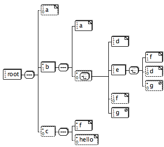

= X2SVG

This is a schema rendering visualisation tool, that I wrote back in the day (around 2008).

X2svg is software to graphically lay out files like DTDs, XML Schema, Java property files, and Ant build files as scalable vector graphics (SVG).
SVG diagrams can be converted into various formats (like PDF or PNG) directly from within x2svg.

== Example

The following DTD
[source, DTD]
----
<!-- The root element of this DTD-->
<!ELEMENT root (a? ,b+ ,c*)>
<!--A simple character node-->
<!ELEMENT a (#PCDATA)>
<!--A selection of d or e-->
<!ELEMENT b (a,(d|e|f?|g)*)>
<!ELEMENT c (f+,hello*)>
<!ELEMENT d (#PCDATA)>
<!ELEMENT e (f+|d?|g*)>
<!ELEMENT f (#PCDATA)>
<!ELEMENT hello (#PCDATA)>
<!ELEMENT g EMPTY>
----

would produce this output:

