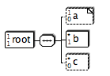

= x2svg

x2svg is a tool to render tree like structures graphically as
scalable vector graphic (SVG). The SVG can then be converted to other
formats like e.g. PDF or raster formats like PNG. The PDF converter
is already built into x2svg. See below for a list of input formats.

.Example
--
Here is an example:

This DTD
[source,dtd]
----
<!-- The root element of this DTD-->
<!ELEMENT root (a? ,b+ ,c*)>
<!--A simple character node-->
<!ELEMENT a (#PCDATA)>
<!--A selection of d or e-->
<!ELEMENT b (a,(d|e|f?|g)*)>
<!ELEMENT c (f+,hello*)>
<!ELEMENT d (#PCDATA)>
<!ELEMENT e (f+|d?|g*)>
<!ELEMENT f (#PCDATA)>
<!ELEMENT hello (#PCDATA)>
<!ELEMENT g EMPTY>
----
will result in a diagram like this:

--

Currently, there are parsers for

* DTD
* Java properties files
* Ant build.xml files
* XML Schema (alpha quality)

Someone :) should
improve the parser for XML Schema documents.

== Build and Install

x2svg builds with maven.
Run `mvn package` to get a fat-jar which you can then run like

`java -cp target/x2svg-jar-with-dependencies.jar de.bsd.x2svg.X2Svg src/test/resources/schema1.json`

== Running

Options are:

*  +/-a: allow / disallow attribute parsing. Depends on the parer if this is supported. Default is off
*   -c [file][:type] : generate output in the format of type in file _file</_
(see <a href="#types">below</a> for possible types)
*   -o file        : write output to &lt;file&gt;.svg instead of
&lt;inputfile-basename>.svg
*   -m (dtd|properties|ant|xsd): Use the given mode instead of guessing the input type
*   -C comment : print a comment on the generated graph.
See <a href="properties.html#subst">here</a> for supported substitutions.
*   -P properties file : specifies the location of <a href="properties.html">x2svg.properties</a>
*   -l list all available parsers.
*   -p mode: show the parser specific help for the specified parser.
Use an asterisk '*' to get it for all parsers.
*   -d: enable debug mode (with lots of non-interesting output :-)
*   +/-M: allow / disallow parsing comments of elements (and possibly
attributes). Depends on the parser if this is supported. Default is off.

Example:
----
 sh run.sh -c /tmp/test.pdf -o /tmp/test.svg sample.dtd root
----

.Note that option -c can be given multiple times.

X2svg usually tries to determine
the output file type from looking at the suffix (e.g. _.pdf_), but this can be
overridden by giving a target type in the optional _:type</_ part. If you want you can
specify the type multiple times to convert into all of those target types. The type specifications
then need to be given next to each other (as in _-c output.foo:png:pdf</_.

It is also possible to only specify the type (as in _-c :pdf_). In this case x2svg will determine
the output file name by chopping off the _.svg_ from the input file name and
appending the standard suffix for the given type.

It is as well possible to give an output directory with a file type only
(as in _-c foo/:png_. In this case the output will be written into
directory _foo/_ and
the filename will be derived from the input filename.

The file link:properties.adoc[] describes the `x2svg.properties` file that can be used to further customize x2svg.
The used symbols are described in link:symbols.adoc[].
