= Symbols

This page explains the symbols used in the rendered graphs. Currently, there are two groups of symbols:

* Content model: those symbols specify if the enclosed elements need to appear in sequence or as a choice.
* Elements: the Elements show the content of the individual nodes of an XML document.

Future versions of x2svg will also show attributes of the elements.

== Content model

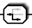::
Elements enclosed can be used alternatively. You have the *choice*.
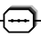::
Elements enclosed need to be issued in the order given here. They need to come in a *sequence*.
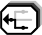::
This symbol specifies that the elements on the right side inherit from those on the left.
It is mostly used within XML Schema.
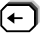::
This symbol specifies that the elements on the right side define a type/substitution
group for those on the left. It is mostly used within XML Schema.

== Elements
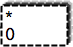::
	This symbol is an empty element box and is sort of an abstract element.
	On the left side, the cardinalities are shown as 'from' on the bottom and 'to' at the top.
	So here we have an element that can occur any number of times.
 +
The fact that the element is *optional* is also shown by the *dashed border*.

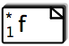::
	This symbol denotes an element with name _f_. The folding sign in
	the upper right corner shows that this is a *text* node. Example:
[source,dtd]
----
	<!ELEMENT f (#PCDATA)>
----

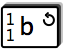::
	The circled arrow in the top right corner denotes that this element has
	already been defined further up in the tree (towards the root element) and
	that its definition would end up in an endless loop. Example:
[source,dtd]
----
<!ELEMENT b (a,c)>
<!ELEMENT a (b,d)>
----

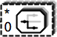::
	This symbol denotes an anonymous element group within an element declaration. Example:
[source,dtd]
----
<!ELEMENT a (b,(c|d)*,e)>
----
Here `(c|d)` is an anonymous container for enclosed elements c and d.
As you can see from the enclosed content model symbol, this is an anonymous container with a choice.

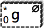::
	The little zero in the top right corner denotes this element as an empty element. Example:
[source,dtd]
----
<!ELEMENT g EMPTY>
----

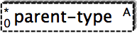::
	The abstract element, denoted by the little _A_ in the top right corner,
	is an element that can not be used on its own, but which stands as a placeholder
	for other elements that inherit from this abstract element. This element type is mostly used within XML Schema.

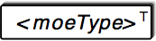::
	The substitution element, denoted by the little _T_ in the top right corner,
	is an element that can not be used on its own, but which denotes a type/substitution
	group that will not be described further (in subtree form). This element type is mostly used within XML Schema.
